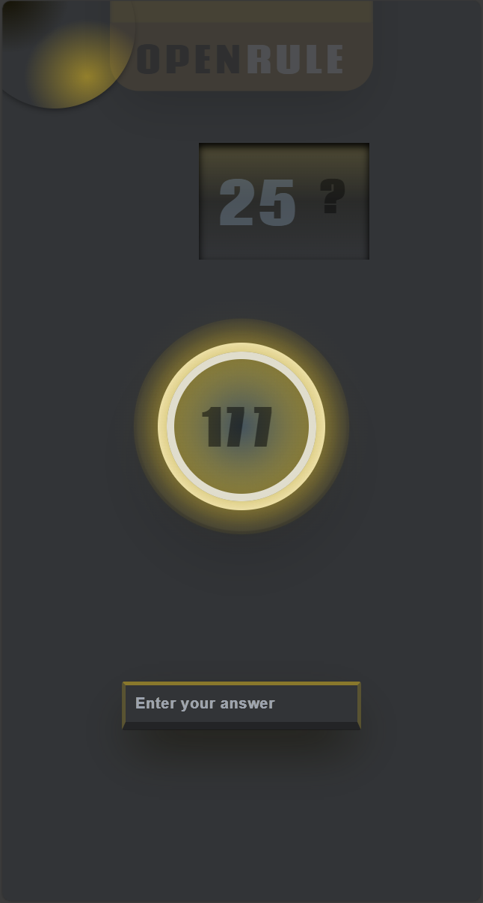

## Getting Started

Clone the both the Front and Back: - add your .env.local Configuration that align with the mapped next.config.ts.

## Learn More

My application is a

> **Real Time⏱⏱⏱ Multi-player ⒻⓘⓏⓏⒷⓤⓏⓏ text-based Game 🎮🎮🎮** >

# Technology Stack 📲📲📲

### Front-End:

- **NextJs (v13+)** on **React v.18**
- Tailwind css.
- Framer motion.
- SignalR Node-client.
- Auth0 m2m

### Back-End:

- **Web API Dotnet** on **.Net 8.0**.
- **SignalR**
- Entity Framework core.
- Authentication with Auth0.
- Serilog

### Data-Layer:

- Mssql:v2019

### Dockerized

# Functionality

 
<h1 >Create your game definition</h1>

- Key: ➕ Interger (Unique in the rule set).
- Value: String

 
<h1 >Update your existed game definition</h1>

- Key: ➕ Interger (Unique in the rule set).
- Value: String.
- delete: will earase your data (proceed with care).
- update: to submit all change

<h1 >Game on 🎮🎮🎮</h1>

- Set your count down (Default: 1 minute)

- When you ready >>

- Do your math.

# UI sample (Mobile):

<figure
    style="{display:flex; flex-direction:row, flex-wrap:wrap}"
>
    
    
    
    
    
</figure>

# Up-comming:
